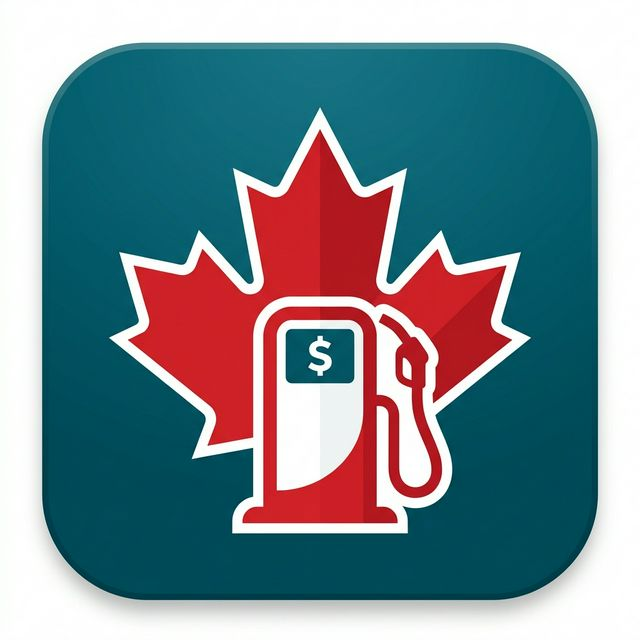

# GasWizard Canada ⛽🍁

  

## Overview
A dynamic Android application built in Flutter that actively tracks and caches Canadian gas prices city-by-city.

**Key Features:**
- 🔄 Background hourly Sync (WorkManager) matching prices against the `canadafuel.guber.dev` API.
- 🔔 Real-time Local Notifications sent if prices increase or drop.
- 📍 Geographic Location Tracking to automatically find your closest supported city upon boot. 
- 🌙 Full native Light and Dark mode theme synchronization with your device.
